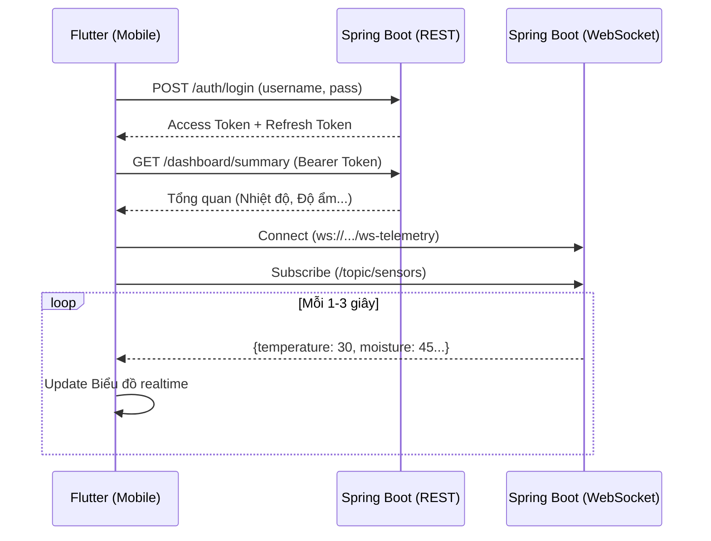

# 🔌 Thiết kế Liên kết (Integration Design)
## Mobile App (Flutter) ↔ Backend (Java Spring Boot)

Tài liệu này định nghĩa cách thức giao tiếp giữa ứng dụng Mobile (UI) và hệ thống Backend. Đây là bản "Hợp đồng API" (API Contract) để team Mobile và team Backend làm việc độc lập mà không bị khớp nhau.

---

## 1. Giao thức & Kiến trúc tổng quan

Hệ thống sử dụng **2 luồng giao tiếp song song**:

1. **REST API (HTTP/HTTPS):** 
   - Dùng cho các thao tác: Đăng nhập, Lấy danh sách thiết bị, Bật/tắt thiết bị, Lấy lịch sử cảm biến.
   - Trả về dữ liệu dạng `JSON`.
   - Client sử dụng thư viện: `Dio` (Flutter).

2. **WebSocket (STOMP Protocol):**
   - Dùng cho: Bắn dữ liệu cảm biến theo thời gian thực (Real-time telemetry) từ Backend xuống Mobile liên tục (ví dụ 1 giây/lần).
   - Trả về dữ liệu dạng `JSON`.
   - Client sử dụng thư viện: `stomp_dart_client` (Flutter).



---

## 2. Luồng Xác thực (Authentication)

Sử dụng **JWT (JSON Web Token)**.

- **Header bắt buộc cho mọi Request (trừ Login):**
  `Authorization: Bearer <access_token>`
- Khi `access_token` hết hạn (Backend trả về `HTTP 401 Unauthorized`), Flutter sẽ tự động gọi API `POST /auth/refresh` bằng `refresh_token` để lấy token mới, sau đó gọi lại API vừa bị lỗi.

---

## 3. Danh sách REST API (API Contract)

### 3.1. Xác thực (Auth)

**1. Đăng nhập**
- **Endpoint:** `POST /api/v1/auth/login`
- **Request (Mobile gửi):**
  ```json
  {
    "username": "admin",
    "password": "password123"
  }
  ```
- **Response (Backend trả về):**
  ```json
  {
    "accessToken": "eyJhbGciOi...",
    "refreshToken": "d7a8b9c..."
  }
  ```

**2. Lấy thông tin User hiện tại**
- **Endpoint:** `GET /api/v1/auth/me`
- **Response:**
  ```json
  {
    "id": 1,
    "username": "admin",
    "email": "admin@example.com",
    "fullName": "Nguyễn Văn A",
    "role": "ADMIN" // hoặc "USER"
  }
  ```

### 3.2. Dashboard & Cảm biến

**1. Lấy dữ liệu Tổng quan (Lần đầu mở app)**
- **Endpoint:** `GET /api/v1/dashboard/summary`
- **Response:**
  ```json
  {
    "autoWateringEnabled": false,
    "soilMoisture": 45.5,
    "temperature": 28.2,
    "humidity": 65.0,
    "lightIntensity": 1200,
    "totalDevices": 5,
    "onlineDevices": 4,
    "lastWateredAt": "2026-09-26T10:30:00Z"
  }
  ```

**2. Lấy Lịch sử Cảm biến (Vẽ biểu đồ)**
- **Endpoint:** `GET /api/v1/sensors/history?from=2026-09-25T00:00:00Z&to=2026-09-26T00:00:00Z`
- **Response (List):**
  ```json
  [
    {
      "id": 101,
      "soilMoisture": 45.0,
      "temperature": 28.0,
      "humidity": 64.0,
      "lightIntensity": 1100,
      "timestamp": "2026-09-25T08:00:00Z"
    },
    // ...
  ]
  ```

### 3.3. Quản lý Thiết bị (Máy bơm, Van, v.v.)

**1. Lấy danh sách thiết bị**
- **Endpoint:** `GET /api/v1/devices`
- **Response:**
  ```json
  [
    {
      "id": 1,
      "name": "Máy bơm chính",
      "type": "PUMP", // PUMP, VALVE, SENSOR, GATEWAY
      "online": true,
      "active": false, // true = đang chạy, false = đang tắt
      "location": "Vườn trước",
      "lastSeen": "2026-09-26T10:30:00Z"
    }
  ]
  ```

**2. Bật / Tắt Thiết bị (Điều khiển thủ công)**
- **Endpoint:** `PUT /api/v1/devices/{id}/toggle`
- **Request:**
  ```json
  {
    "active": true 
  }
  ```
- **Response:** `HTTP 200 OK` (Thành công) hoặc `HTTP 400` (Nếu đang bật chế độ tự động tưới thì không cho bật tay).

**3. Bật / Tắt Chế độ Tưới Tự động**
- **Endpoint:** `POST /api/v1/dashboard/auto-watering`
- **Request:**
  ```json
  {
    "enabled": true
  }
  ```
- **Response:** `HTTP 200 OK`

---

## 4. Real-time WebSocket (STOMP)

Dùng để cập nhật biểu đồ và hiển thị chỉ số nhấp nháy trên Mobile mà không cần Mobile phải gọi API (pull) liên tục.

- **WebSocket URL:** `ws://<backend_ip>:8080/ws-telemetry`
- **Auth:** Gắn Header `Authorization: Bearer <token>` khi Connect STOMP.
- **Topic Mobile cần Subscribe:** `/topic/sensors/realtime`
- **Payload Backend đẩy xuống (Định kỳ hoặc khi có thay đổi):**
  ```json
  {
    "id": 9999,
    "soilMoisture": 42.5,
    "temperature": 29.1,
    "humidity": 60.5,
    "lightIntensity": 1500,
    "timestamp": "2026-09-26T10:45:00Z"
  }
  ```

---

## 5. Quy trình ráp nối (Cách Flutter gọi Backend)

1. **Layer Data (Datasource):** File `api_client.dart` (của Flutter) sẽ định nghĩa URL của Backend. Hiện tại đang để `10.0.2.2:8080` (địa chỉ localhost khi dùng máy ảo Android).
2. **Xử lý JSON:** JSON Backend trả về phải khớp với tên biến trong file Model của Flutter (`user_model.dart`, `device_model.dart`...). Đặc biệt lưu ý quy tắc **camelCase**.
3. **Khi ghép nối thực tế:**
   - Bạn chỉ cần vào `lib/core/constants/api_endpoints.dart` đổi IP thành IP máy tính chạy Java Spring Boot (ví dụ: `192.168.1.5:8080`).
   - Vào `lib/injection.dart`, thay thế các `MockRepository` thành các `RepositoryImpl` có sẵn trong code (sử dụng `Dio` và `STOMP` thật) là ứng dụng sẽ nhận dữ liệu thực!
