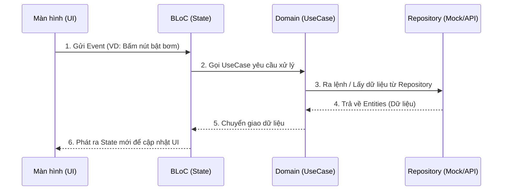

# Kiến trúc Ứng dụng Mobile - Smart Watering System

Dự án này sử dụng mô hình **Feature-First Clean Architecture** (Kiến trúc Sạch chia theo Tính năng) kết hợp với **BLoC Pattern** để quản lý trạng thái.

## 1. Tại sao lại tổ chức kiến trúc như vậy?

- **Dễ chia việc và mở rộng:** Code được gom nhóm theo từng tính năng (Feature) như Auth, Dashboard, Sensor thay vì gom theo loại file. Nhờ vậy, nhiều người có thể code cùng lúc mà không bị conflict (đụng code).
- **Tách biệt giao diện (UI) và nghiệp vụ (Logic):** Giao diện chỉ làm nhiệm vụ "hiển thị", không chứa logic tính toán hay gọi dữ liệu trực tiếp. Việc này giúp app không bị giật lag và cực kỳ dễ sửa lỗi hoặc thay đổi thiết kế sau này.
- **Dễ dàng kết nối Backend:** Code được thiết kế để tách rời hoàn toàn nơi lấy dữ liệu (API/Mock Data) với nơi hiển thị. Khi Backend làm xong, chỉ cần thay lớp dữ liệu giả (Mock) bằng API thật mà không phải sửa lại một dòng code UI nào.

## 2. Khái niệm và Vai trò của từng folder trong `lib/`

- **`app/`**: Chứa các cấu hình cấp cao nhất của toàn bộ ứng dụng (Khởi tạo `MaterialApp`, cấu hình Router chuyển trang với `go_router`, đăng ký các BLoC toàn cục).
- **`core/`**: Chứa các thành phần **dùng chung** cho mọi tính năng.
  - `theme/`: Màu sắc, phông chữ.
  - `widgets/`: Các thành phần UI dùng lại nhiều lần (Nút loading, bảng báo lỗi...).
  - `mock/`: Chứa dữ liệu giả (Fake Data) để UI có thể hiển thị khi chưa có Backend.
- **`features/`**: Trái tim của ứng dụng. Chia thành các thư mục tính năng (auth, dashboard...). Mỗi tính năng chứa 2 tầng chính:
  - `domain/`: **Lớp Cốt lõi**. Chứa `Entities` (cấu trúc dữ liệu như User, Device), `Repositories` (định nghĩa các hàm lấy dữ liệu) và `UseCases` (các hành động cụ thể như LoginUseCase). Lớp này không biết UI là gì.
  - `presentation/`: **Lớp Giao diện**. Chứa `Pages` (các màn hình), `Widgets` (các thành phần nhỏ của màn hình) và `BLoC` (nơi xử lý trạng thái màn hình).
- **`injection.dart`**: Nơi tiêm phụ thuộc (Dependency Injection), làm nhiệm vụ "lắp ráp" các thành phần lại với nhau (cấp phát BLoC, UseCase, Repository) khi app khởi chạy.

## 3. Cách nhận/truyền dữ liệu và Tương tác giữa các lớp (Data Flow)

Dữ liệu luôn chảy theo một luồng khép kín và đơn hướng (Unidirectional Data Flow).

**Giải thích chi tiết:**
1. **Lớp Presentation (UI):** 
   - *Gửi đi:* Khi người dùng bấm nút (VD: Bật máy bơm), UI sẽ gửi một **Event** (Sự kiện) tới lớp `BLoC`.
   - *Nhận về:* Nhận **State** (Trạng thái) từ `BLoC` để tự động vẽ lại giao diện (VD: Đổi màu nút sang Xanh).
2. **Lớp BLoC (State Management):**
   - *Nhận từ UI:* Nhận **Event**.
   - *Gửi đi:* Gọi đến các **UseCase** (thuộc tầng Domain) để yêu cầu thực hiện logic hoặc lấy dữ liệu.
3. **Lớp Domain (UseCase & Repository):**
   - *Nhận từ BLoC:* `UseCase` nhận lệnh, sau đó chuyển tiếp yêu cầu đến `Repository` (Kho dữ liệu).
   - *Gửi đi:* `Repository` (hiện tại là `MockRepository`) sẽ truy xuất dữ liệu giả lập, đóng gói thành các **Entity** (đối tượng thuần túy) và truyền ngược lại lên cho `UseCase`, rồi về lại `BLoC`.
4. **Lớp BLoC cập nhật UI:**
   - Khi nhận được dữ liệu (Entity) từ `UseCase`, `BLoC` sẽ chuyển nó thành một **State** mới (VD: trạng thái `DeviceLoaded`) và bắn ra ngoài. UI lắng nghe State này sẽ tự động cập nhật hiển thị.
